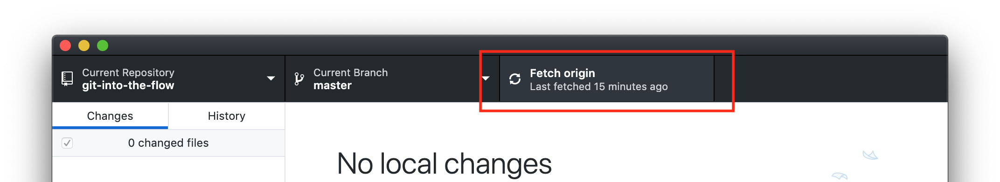

# Git Into The Flow
## [or how to keep track and collaboratively code]

**[Presentation Slides](https://docs.google.com/presentation/d/1N-bmH2BKHRMwNSJHUsmj-rOt9OTLeKyQg-t0MagVcKs/edit?usp=sharing)**

This [ITP Camp 2020](https://itp.nyu.edu/camp2020/) session covers the basics of using Git—*a [version control system](https://guides.github.com/introduction/git-handbook/)*—to keep track of changes in a codebase—*all of the related source code*—over time and use a [Github Flow](https://guides.github.com/introduction/flow/)-like process to manage code changes from a team of collaborators working in a shared codebase.

This Git repository (aka "repo")—*all the files/folders and their history for this codebase*—hosted on Github—*an online host for Git repos*—contains the codebase for a blog site that participants can contribute to by practicing the Git and Github flow skills shared in the camp session.

### Getting Started

- Create a free [Github account](https://github.com/) if you don't already have one and **share your Github username** with the [session leader](https://itp.nyu.edu/camp2020/user/141) in order to get contributor access to this repository
- Download and install the [Github Desktop Application](https://desktop.github.com/)
    - If you're already comfortable in the command line terminal and have the Git command line tools installed, you can also use the [Git commands](https://guides.github.com/introduction/git-handbook/#basic-git) in the terminal

### How To Add A Blog Post

*The steps below roughly follow a Github flow process*

- Fetch and pull the latest code changes on the `master` branch

