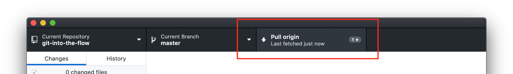

# Git Into The Flow
## [or how to keep track and collaboratively code]

**[Presentation Slides](https://docs.google.com/presentation/d/1N-bmH2BKHRMwNSJHUsmj-rOt9OTLeKyQg-t0MagVcKs/edit?usp=sharing)**

This [ITP Camp 2020](https://itp.nyu.edu/camp2020/) session covers the basics of using Git—*a [version control system](https://guides.github.com/introduction/git-handbook/)*—to keep track of changes in a codebase—*all of the related source code*—over time and use a [Github Flow](https://guides.github.com/introduction/flow/)-like process to manage code changes from a team of collaborators working in a shared codebase.

This Git repository (aka "repo")—*all the files/folders and their history for this codebase*—hosted on Github—*an online host for Git repos*—contains the codebase for a blog site that participants can contribute to by practicing the Git and Github flow skills shared in the camp session.

### Getting Started

- Create a free [Github account](https://github.com/) if you don't already have one and **share your Github username** with the [session leader](https://itp.nyu.edu/camp2020/user/141) in order to get contributor access to this repository
- Download and install the [Github Desktop Application](https://desktop.github.com/)
    - If you're already comfortable in the command line terminal and have the Git command line tools installed, you can also use the [Git commands](https://guides.github.com/introduction/git-handbook/#basic-git) in the terminal

### How To Add A Blog Post

*The steps below roughly follow a [Github flow](https://guides.github.com/introduction/flow/) process*

Fetch and then pull the latest code changes on the `master` branch. This ensures that the copy of code on your own computer is up to date with the code on Github before you branch off to make your own changes.

Create a new branch so that you can make code changes in your own separate environment and space. This gives you the freedom to experiment and prepare your code changes for review in a pull-request on Github. Your branch name should be descriptive so others know what changes/work happened on that branch (e.g. `adrians-demo-post`).

Once you have a new branch, make your code changes. In this case, the changes will be a new blog post. Create a new blog post by creating a copy of the template blog post file in the `_posts` folder—make sure your new copied blog post file follows the same filename convention of YYYY-MM-DD-TITLE.md. These blog posts are Markdown files that can be edited in a code or simple text editor (e.g. Atom, Sublime, TextEdit).

Below you can see a new blog post file was created and the Github Desktop Application detects a new file.

Create a Git commit with a descriptive message (title and optional description) to track this new file addition/code change into this project's Git history. This will make it easier for you and others to understand what code changes were made in this commit ([some popular git commit message conventions](https://tbaggery.com/2008/04/19/a-note-about-git-commit-messages.html)).

Because this is a new branch that was created on your computer, this project's Git repository hosted online on Github is unaware of the new branch and new commit. Publish the branch and push (i.e. upload) the commit to Github so that the code changes are also tracked online.

For any additional code changes you make on your computer, create commits locally on your computer and then push them tothe online repo on Github (aka `origin`).

Once your done making code changes and ready to have collaborators review the code, create a pull-request (i.e. code review) from within the Github Desktop application.

Or create a pull-request from the [online repo on Github.com](https://github.com/itp-camp-2020/git-into-the-flow).

You should then see a webpage that asks for a pull-request title and description. Give details that will make it easier and clearer for collaborators to review your code before it gets merged into the main `master` branch of code. Don't forget to click the button to finish creating the pull-request!

Now your code is ready for review by others in a pull-request!
